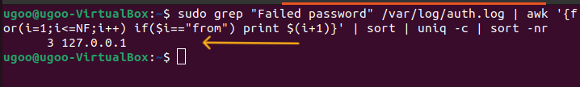
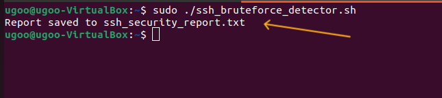
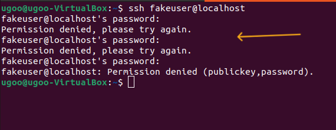
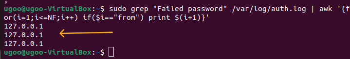
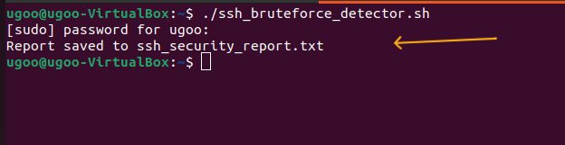

# Linux SSH Log Investigation & Brute-Force Detection

## 🔍 Objective
Investigate SSH failed login attempts in Ubuntu and build a Bash script to detect potential brute-force attacks.

---

## 🖥 Lab Environment
- Ubuntu Virtual Machine
- SSH service enabled
- Log file analyzed: /var/log/auth.log
- Attack simulation via localhost (127.0.0.1)

---

## 🔎 Phase 1: Manual Log Investigation

### 1. Log Access & Permissions
Initial attempt to access /var/log/auth.log resulted in permission denied.
Used sudo to elevate privileges.

### 2. Identify Failed Login Attempts
Used:
sudo grep "Failed password" /var/log/auth.log

### 3. Extract Attacker IP Dynamically
Used:
awk logic to locate the IP address following the "from" keyword.

### 4. Count Failed Attempts
Aggregated and sorted IP addresses using:
sort | uniq -c | sort -nr

---

## ⚙ Phase 2: Bash Automation Script

Created ssh_bruteforce_detector.sh to:
- Extract failed login attempts
- Count occurrences by IP
- Flag IPs with ≥ 3 attempts
- Generate structured security report

---

## 🚨 Detection Logic
If an IP produces 3 or more failed login attempts, it is flagged as suspicious.

---

## 🛡 Mitigation Recommendations
- Enforce SSH key-based authentication
- Disable password authentication
- Deploy Fail2Ban
- Restrict SSH access via firewall rules
- Integrate with SIEM for centralized monitoring

---

## 📸 Screenshots
### Permission Denied Before Using sudo

### Successful Log Access with sudo

### Failed Password Entries

### IP Extraction Output

### Script Execution

### Generated Security Report

